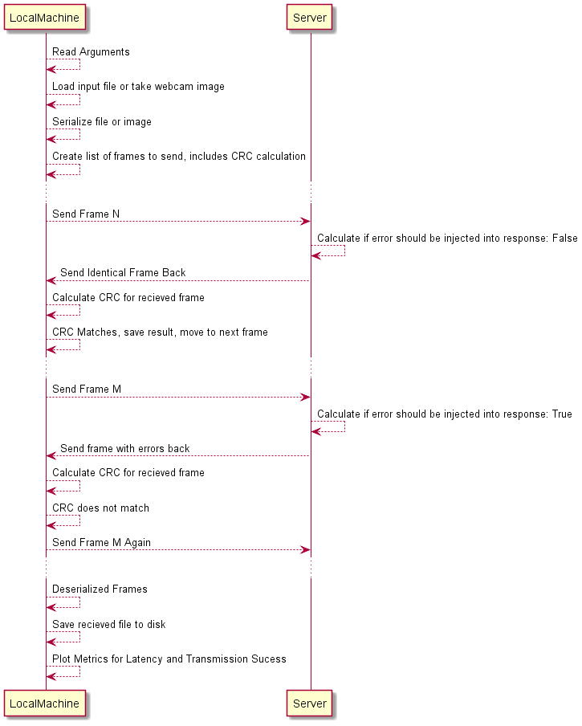
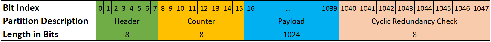

# ECE 570 - Project #2
# A Simple Data Link Layer Protocol
This repository contains all of the code created within scope of a graduate degree course at the University of Michigan Dearborn. 
The course is known as ECE 570 Computer Networks, and was taken by Michael Bowyer (mbowyer@umich.edu) in the Fall 2021 semester. 

## Purpose
The program contained within this repository will serialize a file, split the serialized file into frames of certain length, and then send them to a remote server. It is expected that the remote server sends identical messages back, but with the occasional error. This program will detect those errors using a cyclic redundancy check, and will resend the same frame over again until a message without errors is recieved. 
## Environment Setup
In order to run this python program you must setup a similar environment in which this one was developed in. 

```bash
python3 -m pip install -r env/requirements.txt
```

## Usage

```bash
$ python proj2.py --help
usage: proj2.py [-h] [--port PORT] [--serv_address SERV_ADDRESS] [--file_to_send FILE_TO_SEND] [--show_plots]

Process some integers.

optional arguments:
  -h, --help            show this help message and exit
  --port PORT           The port of the server you would like to send a message to. Default is 4444.
  --serv_address SERV_ADDRESS
                        The address of the server you would like to send a message to. Default is 23.235.207.63.
  --file_to_send FILE_TO_SEND
                        The name of the file to send. Use "webcam" if you would like to transmit an image from your webcam. If unspecified, the default umdlogo image will be used.
  --show_plots          Determines if plots are shown live when running the program.
`````
## Demonstration


## Sequence Diagram

## Tranmitted Frame Structure

## Report
The final report submitted for this work is included in the report: [ECE570_Fall2021_Bowyer_Project2_Report.pdf](ECE570_Fall2021_Bowyer_Project2_Report.pdf)
## Contributing
Michael Bowyer (mbowyer@umich.edu)

## License
[GNU GENERAL PUBLIC LICENSE](https://choosealicense.com/licenses/gpl-3.0/)